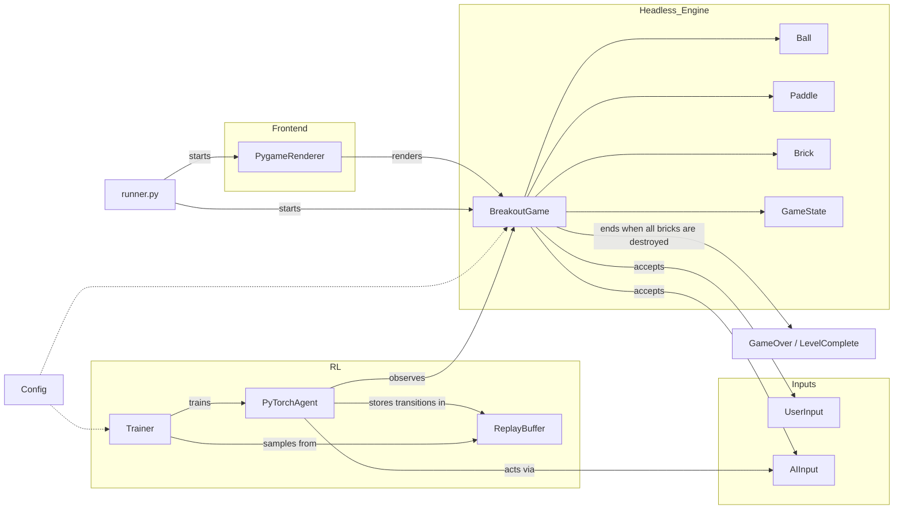
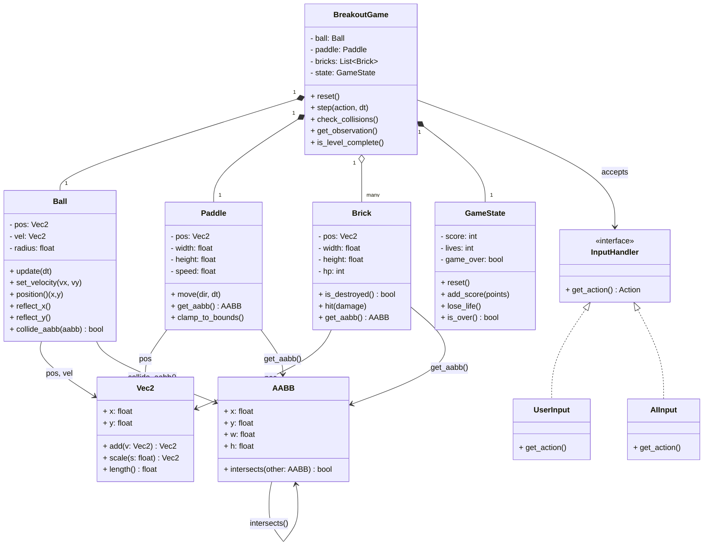

# Reinforced Breakout Documentation

This document provides an overview of the Reinforced Breakout project, including its architecture, components, and how they interact with each other.

## Table of Contents

- [Introduction](#introduction)
- [Architecture](#architecture)
- [Components](#components)
- [Installation](#installation)
- [Usage](#usage)
- [Contributing](#contributing)
- [License](#license)

## Introduction

Reinforced Breakout is an AI-powered version of the classic Breakout game. It uses reinforcement learning to train an agent to play the game effectively. The project is built using Python and leverages libraries such as Pygame for rendering and PyTorch for machine learning.

## Architecture

The architecture of the Reinforced Breakout project is divided into several components, each responsible for a specific part of the system. The following diagram illustrates the high-level architecture:



## Components

### Headless Engine

The headless engine is responsible for the core game logic and state management. It includes the following components:

- **BreakoutGame**: The main game class that manages the game loop, updates the game state, and handles collisions.
- **Ball**: Represents the ball in the game, including its position, velocity, and behavior.
- **Paddle**: Represents the player's paddle, which can be moved to block the ball.
- **Brick**: Represents the bricks that the ball can collide with and break.
- **GameState**: Represents the current state of the game, including the score, level, and game over conditions.


### Inputs

The inputs subcomponent handles user and AI inputs:

- **UserInput**: Processes input from the user, such as keyboard or mouse events.
- **AIInput**: Processes input from the AI agent, allowing it to interact with the game.

### Frontend

The frontend component is responsible for rendering the game:

- **PygameRenderer**: Uses Pygame to render the game graphics, including the game board, paddles, ball, and bricks.

### Reinforcement Learning (RL)

The RL component is responsible for training the AI agent:

- **PyTorchAgent**: The AI agent implemented using PyTorch, which learns to play the game through reinforcement learning.
- **Trainer**: Responsible for training the agent, including updating the agent's neural network based on rewards and observations.
- **ReplayBuffer**: A buffer that stores transitions (state, action, reward, next state) experienced by the agent, used for training the agent.

### Runner

The runner is the entry point of the application:

- **runner.py**: The script that starts the game, renderer, and agent training.

### Config

The config component manages the configuration settings for the project:

- **Config**: A configuration class or module that defines various settings for the game, such as screen size, colors, and game speed.

## Installation

To install and run the Reinforced Breakout project, follow these steps:

1. Clone the repository:

   ```bash
   git clone https://github.com/yourusername/reinforced_breakout.git
   cd reinforced_breakout
   ```

2. Create a virtual environment and activate it:

   ```bash
   python -m venv venv
   source venv/bin/activate
   ```

3. Install the required dependencies:

   ```bash
   pip install -r requirements.txt
   ```

4. Run the game:

   ```bash
   python runner.py
   ```

## Usage

To play the game, use the following controls:

- **Arrow keys**: Move the paddle left and right.
- **Spacebar**: Start or pause the game.
- **Escape**: Quit the game.

The AI agent will play the game automatically if no user input is detected.
